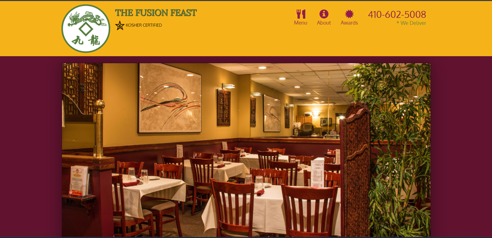

# David Chu's China Bistro

Welcome to David Chu's China Bistro! This repository contains the source code for a restaurant website designed to showcase the offerings and services of David Chu's China Bistro. The website features a responsive design, making it accessible on various devices, and includes sections for the menu, about information, awards, contact details, and customer testimonials.

## Visit Site:
 https://chetankumar9903.github.io/Restaurant_Website/

## Features

- **Responsive Design:** The website is built using Bootstrap and features a responsive layout, ensuring an optimal viewing experience on different devices.
- **Navigation:** The navigation menu provides easy access to various sections of the website, including the menu, about, and awards.
- **Contact Information:** The website prominently displays the restaurant's contact information, including phone number and address, making it convenient for customers to get in touch.
- **Customer Testimonials:** The testimonials section highlights positive feedback from satisfied customers, building trust and credibility.
- **Hours of Operation:** The hours of operation are clearly listed, making it easy for visitors to know when the restaurant is open.
- **Delivery Information:** Information about the restaurant's delivery service, including delivery area and minimum order requirements, is provided.

## AJAX for Dynamic Content

The website utilizes AJAX (Asynchronous JavaScript and XML) to enhance user experience through dynamic content loading. For example:
- **Menu:** The menu section loads menu categories and items using AJAX, allowing visitors to explore the menu without needing to reload the entire page.
- **Contact Form:** The contact form submission uses AJAX to send data to the server and provide real-time feedback to users.

## Created as a Learning Project

This website was created as part of a web development course, where I gained hands-on experience in building responsive and interactive websites using HTML, CSS, Bootstrap, jQuery, and AJAX.

## Getting Started

To explore the website, simply open the `index.html` file in a web browser. The website uses Bootstrap for styling, jQuery for interactivity, and AJAX for dynamic content loading.

## Contributing

Contributions to this project are welcome! If you have suggestions for improvements or new features, feel free to submit a pull request.

